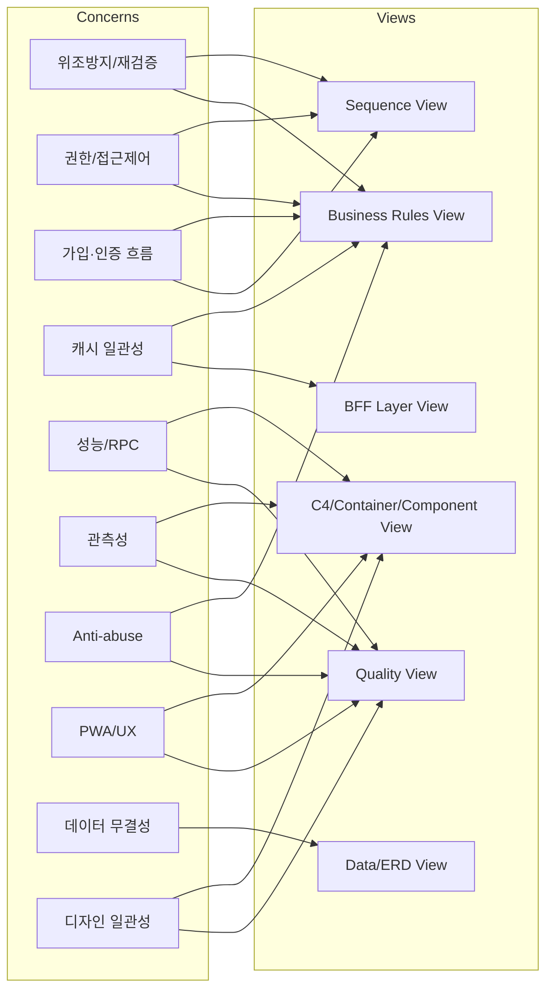

# 관심사 (Concerns) 와 View 매핑

IEEE 42010에서 각 Concern은 하나 이상의 View로 다루어진다. 아래 표는 RunHouse의 명시적/암묵적 Concern과, 이를 표현하는 아키텍처 View를 연결한다. View의 정의와 표현 규칙은 [viewpoints.md](./viewpoints.md)를 참조한다.

## 1. Concern 목록과 다루는 View

| Concern | 제기 이해관계자 | 이를 다루는 View | 근거 |
|---|---|---|---|
| **출석 위조 방지 / 서버 재검증** | 크루 멤버·운영진 | Business Rules View, Sequence View(출석 등록) | `submitAttendance` userId 재검증, 화이트리스트 재검증(Map §3, §6-A) |
| **위치 기반 출석 검증** | 크루 멤버·운영진 | Business Rules View, Sequence View | `위치기반_출석필요한가`, `crew_locations` active 검증(Map §3) |
| **오프라인 출석 가용성** | 크루 멤버 | Container/Component View, Sequence View | `useOfflineAttendance`, `attendance-queue.ts`(IndexedDB)(Map §4-4) |
| **다층 권한/접근 제어** | 운영진·마스터·개발자 | Business Rules View, Sequence View(admin2 가드) | Server Action 가드 + RLS + SECURITY DEFINER(Map §6-D, §9) |
| **가입·크루 인증 2단계 흐름** | 신규 가입자 | Sequence View, Business Rules View | `verifyCrewCodeAction`→`signupAction`(Map §6-B, §6-C) |
| **캐시 일관성(revalidatePath)** | 개발자·멤버 | BFF Layer View, Business Rules View | actions.ts write 후 revalidate 규약(Map §3, §8) |
| **성능/라운드트립 최소화** | 멤버·개발자 | Quality View, Component View | 통합 RPC `get_*_unified`, `React.cache`(Map §9) |
| **관측성(에러/분석)** | 개발자·운영 | Quality View, Container View | Sentry/PostHog/Vercel Analytics(Map §8, §9) |
| **Anti-abuse(rate limit/시간 윈도우)** | 운영진·개발자 | Quality View, Business Rules View | in-memory rate limit, +2h 윈도우(Map §3, §9) |
| **PWA/모바일 네이티브 UX** | 크루 멤버 | Quality View, Component View | manifest, sw.js, 고정 레이아웃(Map §9) |
| **데이터 무결성/도메인 모델** | 개발자·운영진 | Data(ERD) View | `attendance` 스키마 테이블/관계(Map §5) |
| **디자인 시스템 일관성(블루톤 다크)** | 디자인/QA·멤버 | Quality View, Component View | `.pen`, `--rh-*` 토큰(Map §8, §9) |
| **BFF 아키텍처 순수성 강제** | 개발자·QA | BFF Layer View, Quality View | ESLint 7룰 + check-bff/check-domain-tests(Map §8) |
| **서비스 전체 KPI/크루 활성도** | 마스터 관리자 | Sequence View, Data View | master RPCs, `activity_status`(Map §2, §7) |

## 2. Concern 커버리지 다이어그램

## 3. 미해결/주의 Concern (아키텍처 리스크)

Map에 명시된 ⚠️ 항목으로, 해당 View에서 트레이드오프로 다룬다.

- **루트 `middleware.ts` 부재**: 접근제어의 실질 강제가 RSC 가드 + Server Action 가드에 의존. → Business Rules / Sequence View.
- **in-memory rate limit 비영속성**: 서버리스 인스턴스별 상태로 다중 인스턴스 우회 가능. → Quality View.
