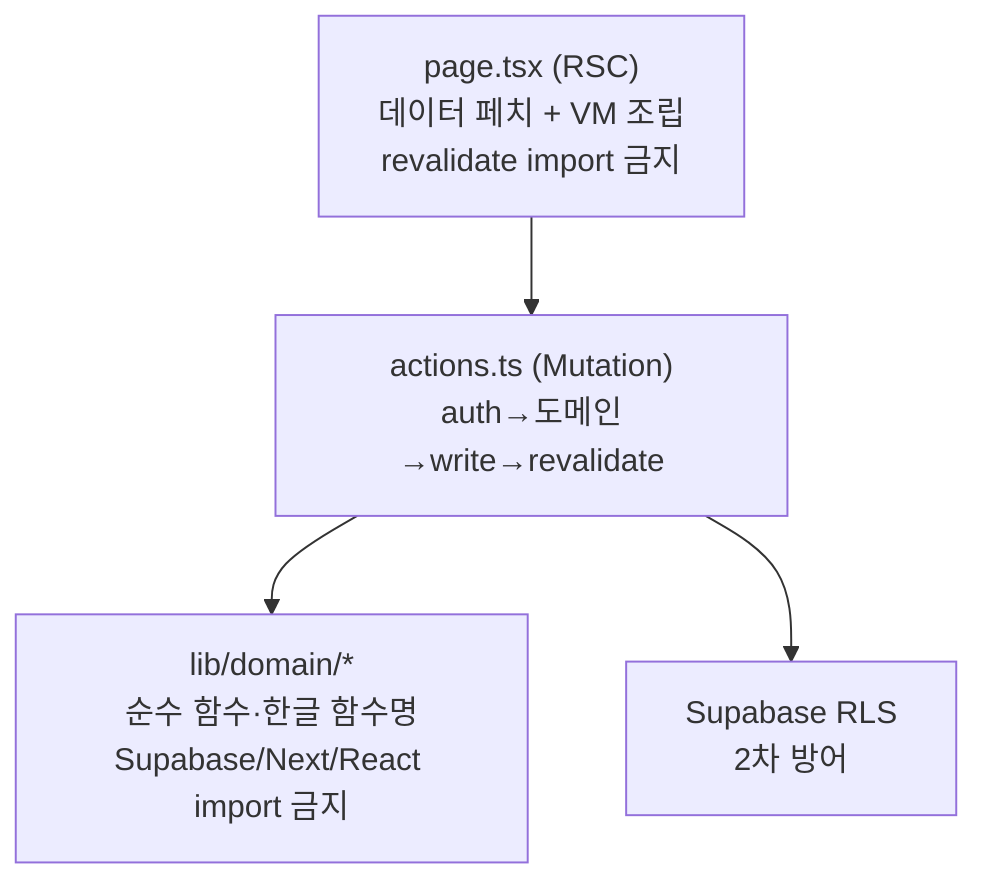
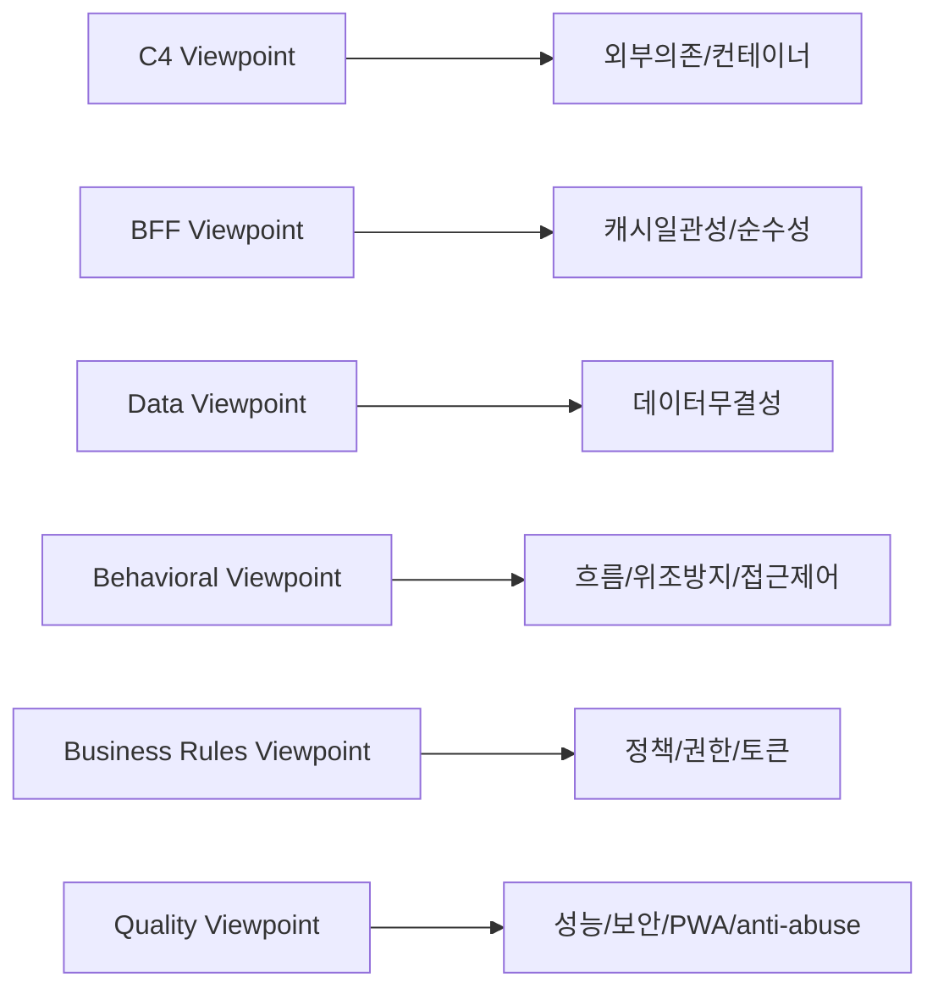

# 관점 (Viewpoints) 정의

Viewpoint는 View를 구성하는 규약(어떤 Concern을 어떤 표기법·규칙으로 표현하는지)이다. 각 View 문서는 아래 Viewpoint 중 하나를 따른다. 매핑되는 Concern은 [concerns.md](./concerns.md), 이해관계자는 [stakeholders.md](./stakeholders.md)를 참조한다.

## 1. Viewpoint 카탈로그

| Viewpoint | 다루는 Concern | 표기법 / 규칙 | 산출 View(문서 위치) |
|---|---|---|---|
| **Context/Container Viewpoint (C4 L1~L2)** | 외부 시스템 의존, 컨테이너 경계 | C4 Context/Container Mermaid `graph`, 노드=시스템/컨테이너 | `01-context/`, `02-container/` |
| **Component/BFF Viewpoint (C4 L3)** | BFF 4계층 순수성, 캐시 일관성, 성능 | 계층 다이어그램 + 파일 경로 근거. 계층 규칙(page/actions/domain/RLS) 명시 | `03-component/` (BFF Layer View) |
| **Data Viewpoint (ERD)** | 데이터 무결성, 도메인 모델 | Mermaid `erDiagram`, `attendance` 스키마 테이블/관계만 사용(Map §5 범위 밖 테이블·컬럼 창작 금지) | `04-data/` (ERD View) |
| **Behavioral Viewpoint (Sequence)** | 출석/가입/권한 흐름, 위조방지, 접근제어 | Mermaid `sequenceDiagram`, 실제 액션/RPC 호출 순서(Map §6 A~E) | `05-sequence/` (Sequence View) |
| **Business Rules Viewpoint** | 정책·권한·토큰·캐시 규약 | 정책 함수명(한글 도메인 컨벤션)과 규칙 표. `lib/domain/*/policies.ts` 근거 | `05-sequence/` 또는 별도 Rules 문서 |
| **Quality Viewpoint** | 성능·보안·가용성·PWA·anti-abuse | 품질속성별 실현 방식 + 트레이드오프 표 | `06-quality/quality-attributes.md` |

## 2. 각 View가 표현하는 규칙

### 2.1 Context/Container Viewpoint (C4)

- **외부 시스템**(Map §8): Supabase(Postgres `attendance` + Auth 카카오 + Storage + RLS), Firebase FCM, PostHog, Sentry, Vercel, Naver Maps, Kakao.
- **컨테이너**: Next.js 14 App Router 웹앱(RSC + Client + Server Actions, PWA), Supabase Postgres+RPC, FCM 서비스워커.
- 규칙: 노드는 Map §8에 등장한 시스템만. service_role(RLS 우회)은 푸시 발송/dev login 경로에만 표기.

### 2.2 Component/BFF Viewpoint

BFF 4계층(Map §8)을 계층 다이어그램으로 표현한다.

규칙: 계층 경계는 ESLint 7룰 + `scripts/check-bff.ts` + `scripts/check-domain-tests.ts`가 `npm run build`에서 강제한다. 새 API Route 추가 금지(`check:bff` build 차단).

### 2.3 Data Viewpoint (ERD)

- 모든 테이블은 `.schema("attendance")`.
- 핵심 관계(Map §5): users 1─N attendance_records N─1 crews; users N─N crews (via user_crews); crews 1─N {invite_codes, locations, exercise_types, grades, notices}; users 1─N {push_tokens, notifications, user_roles}.
- 규칙: Map §5에 관측된 테이블·컬럼만 표기. 추정 컬럼은 "추정"으로 명시.

### 2.4 Behavioral Viewpoint (Sequence)

Map §6의 5개 흐름(A 출석 등록, B 신규 가입, C 기존 사용자 크루 인증, D admin2 뮤테이션 가드, E 홈 활성모임 배너)을 각각 `sequenceDiagram`으로. 참여자는 실제 함수/RPC명 사용.

### 2.5 Business Rules Viewpoint

`lib/domain/*/policies.ts`의 정책 함수를 규칙 표로. 한글 도메인 함수명 컨벤션(`~인가` boolean, `~하기` 실행, `~검증` throw) 준수.

### 2.6 Quality Viewpoint

품질속성(성능/보안/가용성/anti-abuse/PWA/관측성/UX)별로 "실현 방식 + 코드 근거 + 트레이드오프"를 표로. Map §9 근거.

## 3. Viewpoint ↔ Concern 요약

