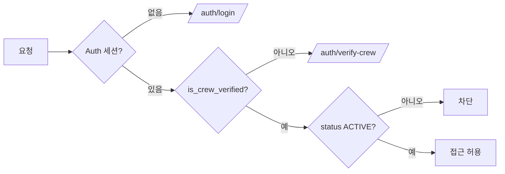

# 비즈니스 규칙 (Business Rules)

각 규칙은 실제 코드 근거를 동반한다. 근거가 없는 규칙은 문서에 넣지 않는다.

## 1. 2단계 인증 (핵심 접근 규칙)

RunHouse의 접근 제어는 2단계로 구성된다.

- 1단계: Supabase Auth(카카오 OAuth) 세션 존재.
- 2단계: 크루 인증(`is_crew_verified` + `verified_crew_id`) — 초대코드로 특정 크루 소속을 증명.

| 규칙 | 내용 | 근거 |
|---|---|---|
| 크루멤버 접근 | `isCrewVerified` AND users.status/user_crews.status 모두 ACTIVE(null/빈값=레거시 ACTIVE) | `lib/domain/access/policies.ts::크루멤버_접근가능한가` |
| 출석등록 가능 | 두 status 가드만으로 비활성 계정 출석 차단 | `lib/domain/access/policies.ts::출석등록_가능한가` |
| 중복 인증 방지 | 이미 인증된 사용자의 재인증 차단 | `lib/domain/auth/policies.ts::인증된_사용자인가` |

> 접근제어의 실질 강제는 루트 `middleware.ts`가 아니라 RSC 가드 + Server Action 가드에 의존한다(맵 §8). 세션 유틸 `lib/supabase/middleware.ts::updateSession`은 세션 없으면 `/auth/login`으로 보내되 `/auth/callback`은 bypass.

## 2. 출석 정책

근거: `lib/domain/attendance/policies.ts`, `app/attendance/actions.ts::submitAttendance`.

| 규칙 | 내용 | 근거 |
|---|---|---|
| 시간 윈도우 | KST 현재 + 최대 2시간(`ALLOW_AHEAD_MS`) 이내만 허용 → 미래 출석 방지 | `유효한가(현재, 출석시각)` |
| 위치검증 강제 | `location_based_attendance===true`일 때만 위치검증 강제 | `위치기반_출석필요한가(crew)` |
| 미등록 허용 | `allow_unregistered_location===true`. 위치기반 ON + 미등록 불허 시 unregistered 거부 | `미등록허용(crew)` |
| userId 위조 방지 | 서버에서 `사용자_컨텍스트_조회()`로 얻은 userId와 input.userId 불일치 시 거부 | `submitAttendance` step 3 |
| 운동종류 재검증 | `exercise_type_id`를 `crew_exercise_types` 화이트리스트로 서버 재검증(클라 캐시 우회 차단) | `submitAttendance` step 5 |
| 장소 재검증 | `location_id`를 `crew_locations`에서 `is_active=true` + `crew_id` 일치 검증 | `submitAttendance` step 5 |

## 3. 인증/가입 정책

근거: `lib/domain/auth/policies.ts`, `workflows.ts`, `app/auth/signup/actions.ts`.

| 규칙 | 내용 | 근거 |
|---|---|---|
| 초대코드 유효 | `is_active===true` (expires_at/max_uses는 추후 통합 예정) | `초대코드_유효한가` |
| 크루정보 완전 | 가입 시 verifiedCrewId + crewCode 둘 다 필수 | `크루정보_완전한가` |
| upsert 페이로드 | NOT NULL 제약 보존(username=user.id, password_hash=''), OAuth provider/카카오 sub 처리 | `가입_upsert_payload_조립` |

## 4. 권한 정책

근거: `lib/domain/master/policies.ts`, `lib/admin2/permissions.ts`.

- `마스터_권한인가`: `role_id === 1`.
- `관리자_역할_결정` 우선순위 **MASTER > OWNER > ADMIN**:
  - role_id=1 → owner
  - crew_role=OWNER → owner
  - role_id=2 → admin
  - crew_role ∈ {CREW_MANAGER, ADMIN} → admin
  - 그 외 → null
- `can(role, action)`: 17개 AdminAction 매트릭스. **현재 owner/admin 권한 동일**.
- admin2 뮤테이션 가드: `lib/admin2/action-auth.ts::assertAdminAction`(auth→users→user_roles/user_crews 병렬→역할 결정→can). RSC 진입 가드는 `lib/admin2/auth.ts::getAdminAuth`(redirect 기반).

## 5. 초대코드 정책

근거: `lib/domain/invite/policies.ts`.

- `커스텀코드_유효한가`: `^[A-Z0-9]{7}$`.
- `어드민코드_생성`: 대문자+숫자 7자. `마스터코드_생성`: 대소문자 7자.
- 첫 관리자 코드(`is_first_admin_code`): 1회 소비(`consumed_by`, ON DELETE SET NULL) — 첫 가입자 자동 매니저 승격.

## 6. 등급 정책

근거: `lib/domain/grade/policies.ts`. PATCH 필드 화이트리스트 매핑(camelCase→snake_case), 매핑 밖 필드는 거부.

## 7. Rate Limiting (Anti-abuse)

근거: `lib/rate-limit.ts` (in-memory Map).

| 대상 | 한도 |
|---|---|
| verify-crew-code | 10 / min / IP |
| signup | 5 / min / IP |

> 주의: 서버리스 인스턴스별 상태(비영속). 다중 인스턴스에서 우회 가능(맵 §9).

## 8. 캐시 규약 (revalidate)

근거: BFF 룰(`CLAUDE.md` L419-471), `next.config.js`.

- `page.tsx`(RSC): 데이터 페치 + VM 조립만. `revalidatePath`/`revalidateTag` import 금지(ESLint 룰4 error).
- `actions.ts`: DB write 후 `revalidatePath` 호출. 관측된 경로:
  - 출석: `revalidatePath('/attendance')`
  - 가입: `revalidatePath('/auth/signup')`
  - 크루 인증: `revalidatePath('/', '/auth/verify-crew')`
- HTTP 캐시 헤더: 정적자산/이미지/`_next/static` 1년 immutable, `/manifest.json` 1년, `/sw.js` no-cache must-revalidate, `/api/ping` no-store.

## 9. 코드베이스에 존재하지 않는 규칙 (명시적 부재)

혼동을 막기 위해 기록한다. 아래 개념은 현재 코드에 구현되어 있지 않다.

- **승인큐(approval queue)**: 출석/가입 승인 대기열 없음. 출석은 즉시 insert된다.
- **edit_token**: 출석 수정 토큰 개념 없음. 수정/삭제는 admin2 액션(`updateAttendanceAction`, `deleteAttendanceAction`)의 권한 가드로만 통제.
- **초대코드 만료(expires_at)/최대사용(max_uses)**: 정책 함수에 TODO로만 언급, 현재 `is_active` 토글로만 통제.
