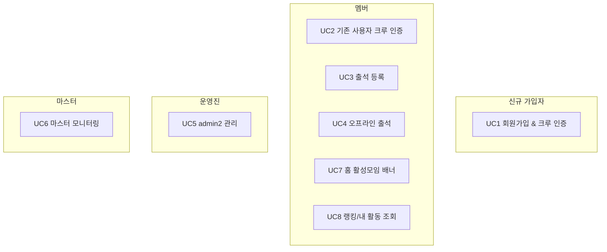
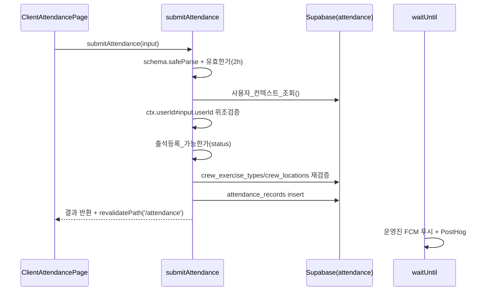

# 주요 유스케이스 (Use Cases)

액터: **멤버**(일반 사용자) · **운영진**(OWNER/CREW_MANAGER) · **마스터**(role_id=1) · **신규 가입자**.

## UC1. 회원가입 & 크루 인증 (신규 가입자)

근거: `app/auth/signup/actions.ts`, 맵 §6-B.

1. 카카오 OAuth 로그인(`/auth/callback`).
2. `verifyCrewCodeAction`(rate limit 10/min → `crew_invite_codes` 조회 → `초대코드_유효한가`).
3. 약관 동의 UI(`ConsentAgreement`, `TermsOfServiceModal`).
4. `signupAction`(rate limit 5/min → `signupSchema` → `크루정보_완전한가` → auth.getUser → email 갱신 → `가입_upsert_payload_조립` → users upsert → `increment_crew_invite_code_used_count` RPC → user_crews upsert → PostHog identify + `server_signup_completed`).
5. `revalidatePath('/auth/signup')`.

## UC2. 기존 사용자 크루 인증 (멤버)

근거: `app/auth/verify-crew/actions.ts::verifyCrewMembershipAction`, 맵 §6-C.

auth.getUser → users 조회 → `인증된_사용자인가` 중복 차단 → `crew_invite_codes` 조인 조회 → `초대코드_유효한가` → users update(`verified_crew_id`, `is_crew_verified`) → `upsert_user_crew` RPC → `invite_code_usage_logs` insert(IP/UA) → `revalidatePath('/', '/auth/verify-crew')`.

## UC3. 출석 등록 (멤버)

근거: `app/attendance/actions.ts::submitAttendance`, 맵 §6-A.

## UC4. 오프라인 출석 (멤버)

근거: `hooks/useOfflineAttendance.ts`, `lib/offline/attendance-queue.ts`, 맵 §4-4.

네트워크 없음 → `enqueueAttendance`로 IndexedDB(idb-keyval) 큐잉 → 온라인 복귀 감지 시 `useOfflineAttendance`가 큐 재전송 → 성공 시 UC3 경로로 처리.

## UC5. 운영진 관리 admin2 (운영진)

근거: `app/admin2/**`, `lib/admin2/*`, 맵 §7.

모든 뮤테이션은 `assertAdminAction(action)` 가드를 통과해야 한다(권한 결정 → `can(role, action)`).

- 대시보드: `get_admin_stats`, `get_admin_users_unified`.
- 멤버: `getAdminCrewUsersAction`.
- 출석: `getAdminAttendanceAction`, `createBulkAttendanceAction`(대량 등록), `getDailyAttendanceAction`, `updateAttendanceAction`, `deleteAttendanceAction`.
- 공지: `getCrewNoticesAction`, `createNoticeAction`, `deleteNoticeAction`, `pushNoticeAction`.
- 푸시: `getPushHistoryAction`, `sendTestPushAction`.
- 설정: 위치기반 토글/정확도/미등록허용(`toggleLocationBasedAttendanceAction`, `updateAccuracyRangeAction`, `updateAllowUnregisteredLocationAction`), 등급/장소/멤버/초대코드 하위 액션.

## UC6. 마스터 모니터링 (마스터)

근거: `app/master/**`, master RPC(SECURITY DEFINER + role_id=1 가드), 맵 §6-6·§7.

- KPI 대시보드: `get_master_dashboard_kpis`.
- 크루 활성도: `get_master_crew_activity`, `get_master_crews_overview`, `get_master_crew_detail`.
- 크루 생성(+첫 관리자 코드): `createCrewAction`, `createCrewWithFirstAdminCodeAction`.
- 글로벌 초대코드: `getMasterInviteCodesAction`, `createMasterInviteCodeAction`, `updateMasterInviteCodeAction`, `deactivateMasterInviteCodeAction`.

## UC7. 홈 활성모임 배너 (멤버)

근거: `get_recent_active_meet` RPC, 맵 §6-E.

홈 RSC → RPC(SECURITY DEFINER, 30분 윈도우, 본인 제외, location 그룹핑, 인원 최다 1건) → `활성모임_배너VM_생성`(표시조건: location 非공백, count≥1, 파싱 가능) → `ActiveMeetBanner` + localStorage dismissKey.

## UC8. 랭킹 / 내 활동 조회 (멤버)

근거: `app/ranking/actions.ts`, `get_ranking_data_unified`, `get_mypage_data_unified`, `get_user_activity_statistics`, 맵 §4-8.

단일 통합 RPC 호출로 랭킹·마이페이지 데이터를 조회 → contribution graph / heatmap 렌더.
