# RunHouse 데이터 ERD

스키마: `attendance` (모든 테이블 `.schema("attendance")`로 접근)

## 확정 출처 범례

각 컬럼/관계 옆 코멘트의 태그는 근거 수준을 뜻한다.

- `[SQL]` — 마이그레이션 DDL(ALTER TABLE/제약)로 컬럼·제약이 확정됨.
- `[코드]` — `lib/types`·`lib/domain/*/types.ts`·`admin.ts` 등 코드, 또는 RPC의 SELECT/RETURN 투영에서 컬럼 존재가 관측됨.
- `[추정]` — 코드/RPC에서 직접 확인되지 않아 관례상 추정.

> RPC 파일은 `.sql` 확장자이지만 base 테이블을 SELECT/RETURN으로 **투영**할 뿐 DDL로 정의하지 않으므로, RPC로만 관측된 컬럼은 `[SQL]`이 아니라 `[코드]`로 분류한다. ALTER로 정의됨과 동시에 RPC가 투영하는 컬럼은 더 강한 `[SQL]`로 태깅한다.

## 전체 ERD

```mermaid
erDiagram
    users ||--o{ attendance_records : "출석 남김"
    users ||--o{ user_crews : "멤버십"
    crews ||--o{ user_crews : "멤버십"
    crews ||--o{ attendance_records : "소속 출석"
    crews ||--o{ crew_invite_codes : "초대코드 발급"
    crews ||--o{ crew_locations : "등록 장소"
    crews ||--o{ crew_exercise_types : "허용 운동종류"
    crews ||--o{ crew_grades : "등급 오버라이드"
    crews ||--o{ notices : "공지"
    exercise_types ||--o{ crew_exercise_types : "마스터 참조"
    exercise_types ||--o{ attendance_records : "운동종류"
    grades ||--o{ crew_grades : "마스터 참조"
    crew_grades ||--o{ grade_promotion_logs : "승급 이력"
    crew_grades |o--o{ user_crews : "멤버 등급([SQL] SET NULL)"
    users ||--o{ user_roles : "시스템 역할"
    users ||--o{ user_push_tokens : "FCM 토큰"
    users ||--o{ notifications : "알림 히스토리"
    users ||--o{ push_history : "발송(운영진)"
    users ||--o{ grade_promotion_logs : "승급 대상"
    crew_invite_codes ||--o{ invite_code_usage_logs : "사용 로그"
    users ||--o{ invite_code_usage_logs : "사용자"
    crew_invite_codes }o--o| users : "consumed_by([SQL] 1회 소비)"
    users }o--o| crews : "verified_crew_id(인증 크루)"

    users {
        uuid id PK "[코드] = auth uid"
        varchar first_name "[코드]"
        varchar email "[코드]"
        varchar phone "[코드]"
        int birth_year "[코드]"
        varchar status "[코드] ACTIVE/SUSPENDED"
        bool is_crew_verified "[코드]"
        uuid verified_crew_id FK "[코드]"
        varchar username "[코드] NOT NULL, = id"
        varchar password_hash "[코드] NOT NULL, ''"
        varchar oauth_provider "[코드]"
        varchar oauth_id "[코드] 카카오 sub"
        text profile_image_url "[코드]"
        bool privacy_consent_agreed "[코드]"
        timestamptz privacy_consent_agreed_at "[코드]"
        bool terms_of_service_agreed "[코드]"
        timestamptz terms_of_service_agreed_at "[코드]"
        timestamptz updated_at "[코드]"
    }

    crews {
        uuid id PK "[코드]"
        varchar name "[코드]"
        text description "[코드]"
        varchar region "[코드]"
        text profile_image_url "[코드]"
        int max_members "[코드]"
        bool location_based_attendance "[코드]"
        int accuracy_range "[코드] m"
        bool allow_unregistered_location "[코드]"
        timestamptz created_at "[코드]"
        timestamptz updated_at "[코드]"
    }

    user_crews {
        uuid user_id PK,FK "[코드]"
        uuid crew_id PK,FK "[코드]"
        varchar crew_role "[코드] OWNER/CREW_MANAGER/MEMBER"
        varchar status "[코드] ACTIVE/SUSPENDED"
        timestamptz joined_at "[코드]"
        int crew_grade_id FK "[SQL] →crew_grades, ON DELETE SET NULL"
    }

    attendance_records {
        uuid id PK "[코드]"
        uuid user_id FK "[코드]"
        uuid crew_id FK "[코드]"
        uuid exercise_type_id FK "[코드]"
        bool is_host "[코드]"
        timestamptz attendance_timestamp "[코드]"
        text location "[코드] 장소명 스냅샷"
        timestamptz deleted_at "[코드] soft delete"
    }

    crew_invite_codes {
        int id PK "[코드]"
        uuid crew_id FK "[코드]"
        varchar invite_code UK "[코드]"
        text description "[코드]"
        bool is_active "[코드]"
        int used_count "[코드]"
        int max_uses "[코드]"
        timestamptz expires_at "[코드]"
        uuid created_by FK "[코드] →users"
        bool is_first_admin_code "[SQL] NOT NULL DEFAULT FALSE"
        uuid consumed_by FK "[SQL] →users, ON DELETE SET NULL"
        timestamptz created_at "[코드]"
        timestamptz updated_at "[코드]"
    }

    crew_locations {
        int id PK "[코드]"
        uuid crew_id FK "[코드]"
        varchar name "[코드]"
        text description "[코드]"
        float latitude "[코드]"
        float longitude "[코드]"
        bool is_active "[코드]"
        timestamptz created_at "[코드]"
        timestamptz updated_at "[코드]"
    }

    exercise_types {
        uuid id PK "[코드]"
        varchar name "[코드]"
    }

    crew_exercise_types {
        uuid id PK "[코드]"
        uuid crew_id FK "[코드]"
        uuid exercise_type_id FK "[코드]"
        bool is_active "[코드]"
    }

    grades {
        int id PK "[코드]"
        varchar name "[코드]"
    }

    crew_grades {
        int id PK "[코드]"
        uuid crew_id FK "[코드]"
        int grade_id FK "[코드] →grades"
        varchar name_override "[코드]"
        text description_override "[코드]"
        int min_attendance_count "[코드]"
        int min_hosting_count "[코드]"
        varchar promotion_period_type "[코드]"
        int sort_order "[코드]"
        bool can_host "[코드]"
        bool is_active "[SQL] soft delete"
    }

    grade_promotion_logs {
        uuid id PK "[추정]"
        uuid user_id FK "[코드] →users"
        uuid crew_id FK "[코드]"
        int to_grade_id "[코드] 승급 대상 등급(FK 대상 미확정)"
        varchar change_type "[코드] manual/approved"
        uuid changed_by "[코드] →users"
        timestamptz created_at "[추정]"
    }

    user_roles {
        uuid user_id FK "[코드]"
        int role_id "[코드] 1=MASTER_ADMIN, 2=ADMIN"
    }

    admin_roles {
        uuid user_id FK "[코드]"
        bool is_super_admin "[코드]"
    }

    notices {
        uuid id PK "[추정]"
        uuid crew_id FK "[코드]"
        varchar title "[코드]"
        varchar type "[코드]"
        text content "[코드]"
        bool is_active "[코드]"
        uuid author_id FK "[코드] →users"
        timestamptz created_at "[코드]"
    }

    notifications {
        uuid id PK "[추정]"
        uuid user_id FK "[코드] 수신자"
        uuid crew_id FK "[코드]"
        varchar type "[코드]"
        varchar title "[코드]"
        text body "[코드]"
        bool is_read "[추정]"
        timestamptz created_at "[추정]"
    }

    push_history {
        uuid id PK "[코드]"
        uuid crew_id FK "[코드]"
        uuid sent_by FK "[코드] →users"
        varchar title "[코드]"
        varchar target_mode "[코드]"
        int target_count "[코드]"
        int success_count "[코드]"
        int failure_count "[코드]"
        timestamptz created_at "[코드]"
    }

    user_push_tokens {
        uuid id PK "[추정]"
        uuid user_id FK "[코드]"
        uuid crew_id FK "[코드]"
        text token "[코드]"
        bool is_active "[코드]"
        timestamptz updated_at "[추정]"
    }

    invite_code_usage_logs {
        uuid id PK "[코드]"
        int invite_code_id FK "[코드]"
        uuid user_id FK "[코드]"
        varchar user_ip "[코드]"
        text user_agent "[코드]"
        timestamptz used_at "[코드]"
    }
```

## 관계 요약

- `users` 1─N `attendance_records` N─1 `crews` (출석은 사용자·크루에 각각 종속)
- `users` N─N `crews` (via `user_crews`, 복합 PK)
- `crews` 1─N `{crew_invite_codes, crew_locations, crew_exercise_types, crew_grades, notices}`
- `users` 1─N `{user_push_tokens, notifications, user_roles, invite_code_usage_logs}`
- `exercise_types`·`grades`는 마스터 테이블, `crew_exercise_types`·`crew_grades`는 크루별 오버라이드
- `crew_grades` 1─N `user_crews`(via `crew_grade_id`, nullable) — 멤버의 현재 크루 등급. FK `user_crews_crew_grade_id_fkey`, `ON DELETE SET NULL` — [SQL] (20260502 cleanup 마이그레이션에서 확인)
- `crew_invite_codes.consumed_by` → `users.id` (1회용 첫관리자 코드, `ON DELETE SET NULL`) — [SQL]
- `users.verified_crew_id` → `crews.id` (2단계 인증으로 확정된 소속 크루) — [코드]

> ⚠️ 관측 한계
> - `crew_locations`의 위경도(`latitude`/`longitude`)는 `lib/types/crew-locations.ts`에서 `number`로 관측되어 이제 [코드] 확정(기존 "추정" 해소).
> - 과거 ERD의 `image` 엔티티는 DB 테이블이 아니라 Supabase **Storage 버킷**(`supabase.storage.from("image")`)이므로 엔티티에서 제거했다.
> - `grade_promotion_logs.to_grade_id`는 컬럼명만 관측되며 참조 대상(`grades` vs `crew_grades`)이 미확정이라 관계선을 그리지 않았다.
> - `[추정]` 태그는 코드/RPC에서 확인되지 않은 컬럼·타입이다. 실제 CREATE TABLE DDL 확보 시 확정 갱신 필요.
</content>
</invoke>
