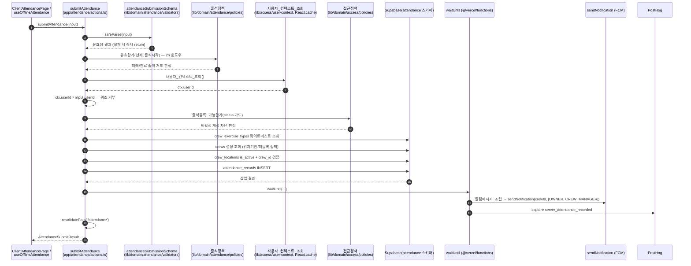
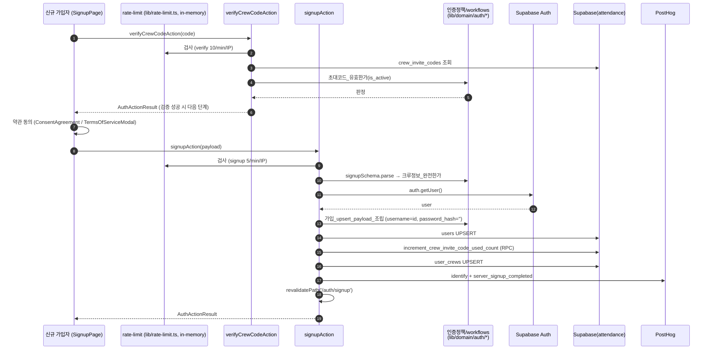
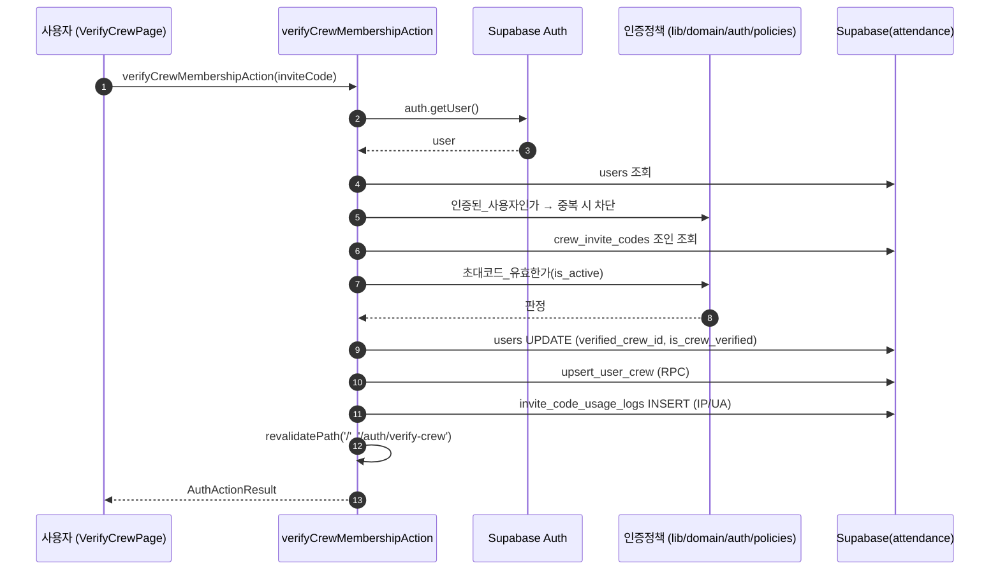
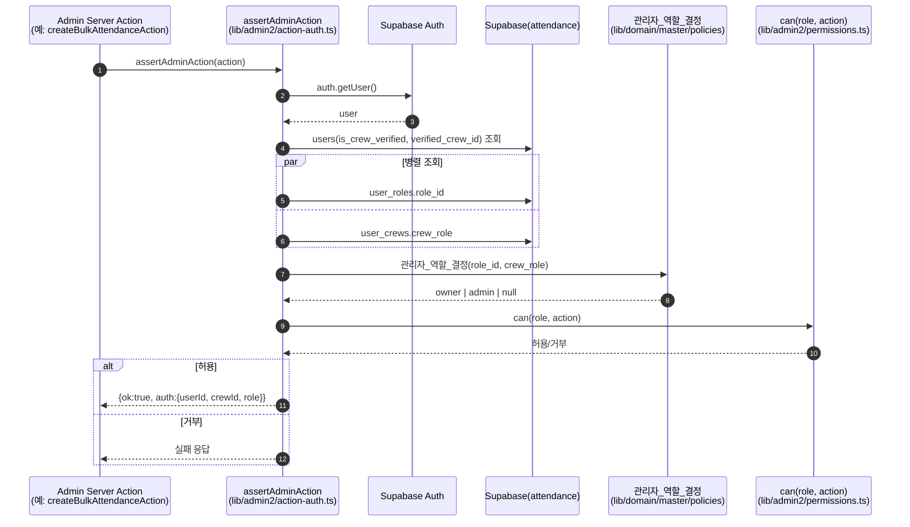
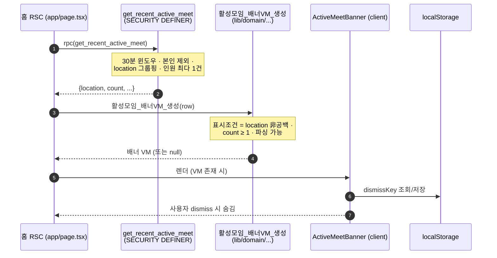

# 프로세스 뷰 — 핵심 시퀀스 플로우

이 문서는 RunHouse의 대표 런타임 흐름을 Mermaid `sequenceDiagram`으로 기술한다.
모든 참여자/함수/파일명은 실제 코드베이스에서 관측된 것이며, BFF 4계층 규약
(page.tsx → actions.ts → lib/domain → Supabase RLS)을 따른다.

---

## A. 출석 등록 (`app/attendance/actions.ts::submitAttendance`)

가장 핵심적인 쓰기 경로. 위조 방지(서버측 userId 재검증)와 화이트리스트
재검증(exercise_type / location)이 이 흐름의 보안 골자다.

---

## B. 신규 가입 & 크루 인증 (`app/auth/signup/actions.ts`)

카카오 OAuth 후 2단계: 초대코드 1차 검증 → 약관 동의 → 가입 upsert.

---

## C. 기존 사용자 크루 인증 (`app/auth/verify-crew/actions.ts::verifyCrewMembershipAction`)

이미 로그인된 사용자가 초대코드로 특정 크루 소속을 증명하는 흐름.
중복 인증 방지와 감사 로그(IP/UA) 기록이 특징.

---

## D. admin2 뮤테이션 가드 (`lib/admin2/action-auth.ts::assertAdminAction`)

운영진 전용 쓰기 Server Action이 실행 전 통과하는 공통 권한 가드.
role_id + crew_role을 병렬 조회해 `관리자_역할_결정`으로 통합 역할을 산출한다.

---

## E. 홈 활성모임 배너 (`get_recent_active_meet` RPC)

최근 30분 내 같은 크루의 진행중 모임을 홍보하는 홈 배너 흐름.
자기참조 방지(본인 출석 제외)와 표시조건 필터가 핵심.

---

## 관련 문서
- 데이터 모델 / 컨테이너: 아키텍처 맵 §5, §8
- 인터페이스(경로/입출력/인증요건): [../04-interface/api-and-actions.md](../04-interface/api-and-actions.md)
