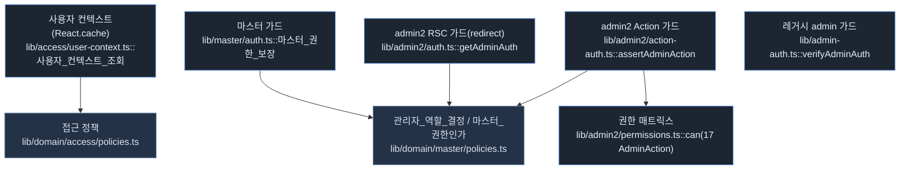
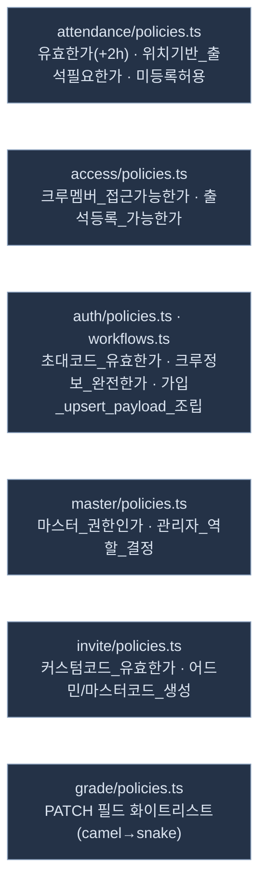
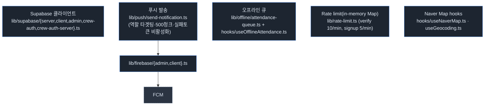
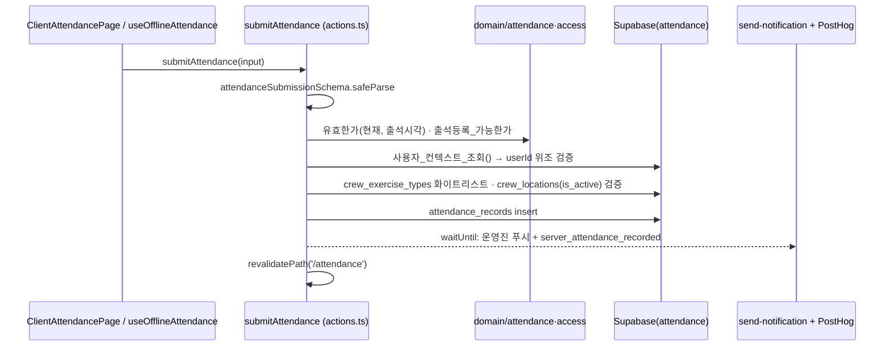

# C4 Component — RunHouse 주요 컨테이너 내부 컴포넌트

Next.js 앱 컨테이너 내부의 인증 가드·도메인·인프라 모듈을 실제 파일 경로에 매핑한다.
(근거: 맵 §3 Business Rules, §6 Sequence Flows, §8 Notable Components)

## C1. 인증/권한 가드 컴포넌트



- 출석 위조 방지: `submitAttendance`가 `사용자_컨텍스트_조회()`의 userId와 입력 userId를 비교. (맵 §6-A)
- admin2 뮤테이션: `assertAdminAction` → `관리자_역할_결정` → `can(role, action)`. (맵 §6-D)

## C2. 도메인 레이어 (lib/domain/**)



- 규약: Supabase/Next/React import 금지(ESLint 룰1~3), Vitest 1:1, 한글 함수명 컨벤션(`~인가`/`~하기`/`~검증`). (맵 §3·§8)

## C3. 인프라/횡단 컴포넌트



- ⚠️ Rate limit은 서버리스 인스턴스별 비영속 상태 — 다중 인스턴스 우회 가능. (맵 §9 Anti-abuse)

## C4. 출석 등록 컴포넌트 상호작용 (Use Case §6-A)



## 범례 (Legend)
- 진한 배경: 코드 컴포넌트/모듈. 남색: 파일 단위 도메인 정책. 점선 테두리: 외부 시스템.
- 노드 라벨 하단은 실제 파일 경로 및 대표 함수(한글 도메인 함수명 포함).

## 인터랙션 · 모션 레이어 (`lib/motion/`)

제스처 UI의 물리 계산을 격리하는 순수 함수 레이어. `lib/domain/`(비즈니스 룰)과 성격이 다르므로
분리하되, 강제 장치(ESLint 순수성 · 1:1 테스트 · Vitest)는 동일한 것을 공유한다.

```
lib/motion/gesture.ts   모멘텀 투사 · 러버밴딩 · 닫기 판정 · 진행률
lib/motion/spring.ts    Apple 스펙(감쇠비·응답) → Framer Motion(stiffness·damping)
      ↓ (React 의존 금지 — ESLint 강제)
hooks/useDragSheet.ts   포인터 이벤트 → 순수 함수 호출 → 상태
      ↓
components/ui/DragSheet.tsx   포털 · 스크림 동기화 · 접근성
      ↓
바텀시트 5종 (MapBottomSheet, NoticeBottomSheet, NoticeListSheet,
              SortFilterSheet, AdminMemberPickerSheet)
```

- **커버리지 100% 강제** — `lib/motion/**`만 임계를 걸며 `npm run build`에 포함된다.
  `lib/domain/**`은 1:1 테스트 존재만 강제하고 비율 임계는 걸지 않는다.
- **`MapTemplate`은 예외** — collapsed/detail 스냅 포인트를 갖는 다단계 시트라
  열림/닫힘 이분 모델인 `DragSheet`로 대체할 수 없다. 컨테이너는 자체 유지하되
  **판정 물리만** `닫아야_하는가`로 통일했다.
- 상세 규칙: [`lib/motion/README.md`](../../../lib/motion/README.md)
