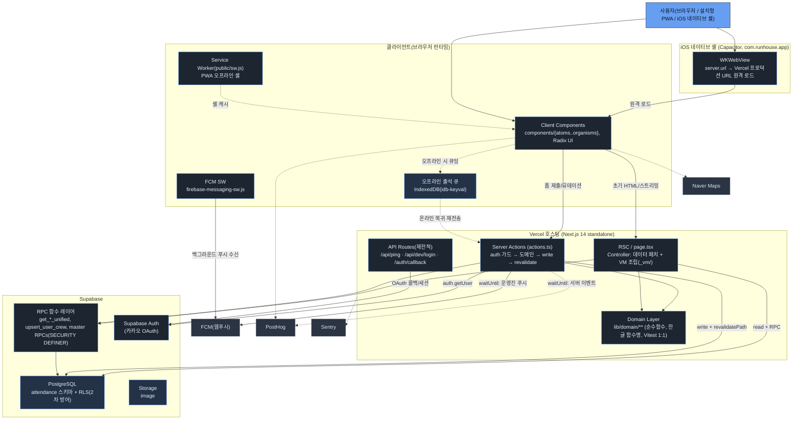

# C4 Container — RunHouse 컨테이너 뷰

배포/실행 단위와 BFF 4계층 흐름을 표현한다.
(근거: 맵 §8 Containers/BFF 4계층, §7 Interfaces, §9 PWA)

## 다이어그램

## 범례 (Legend)
- 진한 배경: 실행 컨테이너/모듈. 남색 저장소: 상태 저장(Postgres/Storage/IndexedDB). 점선 테두리: 외부 SaaS.
- 실선: 요청 경로 내 호출. 점선: 응답 경로 밖(`waitUntil`) 또는 오프라인/비동기 경로.

## BFF 4계층 (아키텍처 강제)
1. `page.tsx`(RSC) — 페치 + VM 조립만. `revalidatePath`/`revalidateTag` import 금지(ESLint 룰4).
2. `actions.ts` — auth→도메인→write→`revalidatePath` (예: `/attendance`, `/`, `/auth/verify-crew`).
3. `lib/domain/**` — 순수함수, Supabase/Next/React import 금지(ESLint 룰1~3), Vitest 1:1.
4. Supabase RLS — 2차 방어.
- `scripts/check-bff.ts` + `scripts/check-domain-tests.ts` + ESLint 7룰이 `npm run build`에서 강제. (맵 §8)

## 컨테이너 노트
- **API Route 신규 추가 금지** — `check:bff`가 build 차단. 뮤테이션은 Server Action으로. (맵 §7)
- **루트 middleware.ts 부재** — 접근제어 실질 강제는 RSC 가드 + Server Action 가드. `lib/supabase/middleware.ts::updateSession`은 유틸. (맵 §8)
- **iOS 네이티브 셸(Capacitor)**: `capacitor.config.ts` + `ios/` (Xcode 프로젝트, SPM 기반).
  Next.js App Router는 정적 export가 불가능하므로 웹 자산을 번들하지 않고
  `server.url`로 Vercel 프로덕션을 원격 로드한다. `webDir`은 Capacitor가
  존재를 요구하기 때문에 폴백 스텁(`capacitor-shell/`)을 가리킨다.
  `server.allowNavigation`에 카카오/Supabase/네이버 호스트를 등록해
  OAuth 리다이렉트가 웹뷰 밖으로 이탈하지 않게 한다.
  - **제약**: WKWebView에서는 Service Worker가 동작하지 않아 셸 캐시·웹푸시(FCM)가
    비활성이다. 네이티브 푸시가 필요하면 `@capacitor/push-notifications` + APNs로
    별도 구현해야 한다.
  - 배포 경로: `xcodebuild archive/exportArchive` → TestFlight (App Store Connect).
- **오프라인 출석**: 네트워크 단절 시 IndexedDB 큐잉(`enqueueAttendance`) → `useOfflineAttendance`가 재전송. (맵 §4·§6)
