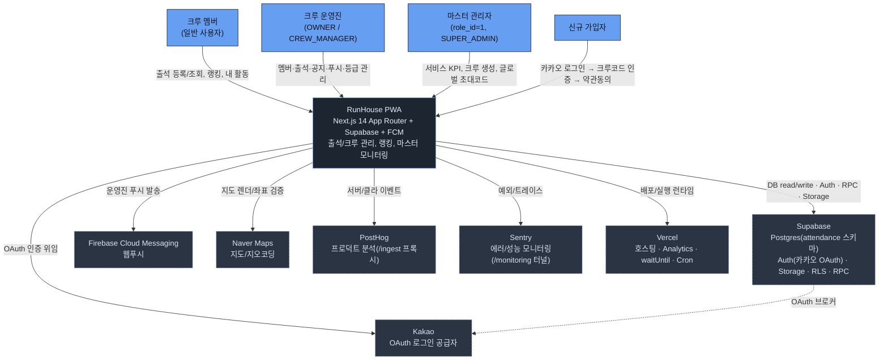

# C4 Context — RunHouse(런하우스) 시스템 컨텍스트

러닝크루 출석/크루 관리 PWA. 사용자 유형과 외부 SaaS 경계를 표현한다.
(근거: 아키텍처 맵 §1 Stakeholders, §8 C4 Context)

## 다이어그램

## 범례 (Legend)
- 파란 채움: 사람(Person) / 진한 배경: 대상 시스템(RunHouse) / 점선 테두리: 외부 SaaS.
- 실선 화살표: 직접 호출/사용. 점선: 위임(브로커) 관계.

## 핵심 관계 노트
- **인증 경계**: 2단계 인증 — Supabase Auth(카카오 OAuth) + `is_crew_verified`(크루 인증). 카카오는 Supabase가 OAuth 브로커로 중개한다. (맵 §9 보안)
- **service_role(RLS 우회)** 사용은 푸시 발송/dev login으로 제한. (맵 §8)
- **PostHog `/ingest`**, **Sentry `/monitoring`** 은 광고차단 회피용 역프록시/터널 경유. (맵 §8, next.config.js rewrites)
- 맵에 Discord 연동 근거는 없어 컨텍스트에서 제외했다.
