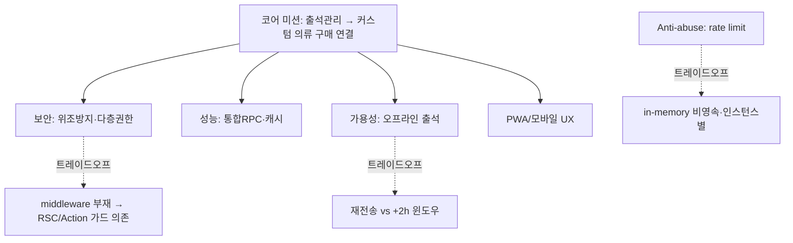

# 품질 속성 (Quality Attributes)

이 View는 RunHouse에서 **실제로 강제되는** 품질속성을 다룬다. 각 속성별로 실현 방식·코드 근거·트레이드오프를 정리한다. 다루는 Concern은 [../00-overview/concerns.md](../00-overview/concerns.md)를 참조한다.

## 1. 성능 / 캐싱 (Performance)

| 기법 | 실현 방식 | 코드 근거 |
|---|---|---|
| 라운드트립 최소화 | 페이지당 단일 통합 RPC 호출 | `get_*_unified`, `get_home_page_data`, `get_attendance_form_data`(Map §7, §9) |
| HTTP 캐시 헤더 | 정적/이미지/`_next/static` 1년 immutable, WebP/AVIF 변환 | `next.config.js`(Map §3, §9) |
| 번들 최적화 | `optimizePackageImports`(Radix/lucide/framer), splitChunks vendor/common, tree-shaking, Turbopack dev | `next.config.js`(Map §9) |
| 요청당 auth 1회 | `React.cache`로 auth 컨텍스트 중복 조회 제거 | `사용자_컨텍스트_조회`, `getAdminAuth`, `마스터_권한_보장`(Map §9) |
| 응답 경로 밖 처리 | 푸시/분석을 `waitUntil`로 비동기 | `@vercel/functions`, `submitAttendance`(Map §6-A, §9) |
| dev 렌더 최적화 | reactStrictMode dev off, dev Sentry 래핑 스킵 | Map §9 |

**트레이드오프**: 통합 RPC는 라운드트립을 줄이지만 RPC가 SECURITY DEFINER 로직을 품어 DB 함수 복잡도·유지보수 비용이 커진다. `revalidatePath` 캐시 무효화는 actions.ts에만 허용(page.tsx import 금지, ESLint 룰4)되어 캐시 일관성은 확보되지만, revalidate 대상 경로를 액션마다 수동 지정해야 해 누락 위험이 있다.

## 2. 보안 / 권한 (Security)

| 기법 | 실현 방식 | 코드 근거 |
|---|---|---|
| 2단계 인증 | Supabase Auth(카카오) + `is_crew_verified` | Map §2, §9 |
| 서버측 userId 재검증 | 출석 위조 방지 — `ctx.userId ≠ input.userId` 거부 | `submitAttendance`(Map §6-A) |
| status 가드 | 비활성 계정 출석/접근 차단 | `접근정책.출석등록_가능한가`(Map §3) |
| 화이트리스트 재검증 | 클라 캐시 우회 방지(삭제된 종류/장소 출석 차단) | `crew_exercise_types`, `crew_locations` active 검증(Map §3, §6-A) |
| 다층 권한 | Server Action 가드(1차) + RLS(2차) + 마스터 RPC SECURITY DEFINER `role_id=1`(3차) | `assertAdminAction`, 마스터 RPCs(Map §6-D, §7, §9) |
| 감사 로그 | 초대코드 사용 IP/UA 기록 | `invite_code_usage_logs`(Map §5, §6-C) |
| 보안 헤더 | X-Content-Type-Options nosniff, X-XSS-Protection, poweredByHeader off | `next.config.js`(Map §9) |
| dev 라우트 차단 | production 403 | `/api/dev/login`(Map §7, §9) |
| 아키텍처 순수성 강제 | 도메인 계층 Supabase/Next/React import 금지 | ESLint 룰1~3 + `check-bff`(Map §8) |

**트레이드오프**: ⚠️ 루트 `middleware.ts`가 트리에 없어(Map §8) 접근제어의 실질 강제는 RSC 가드 + Server Action 가드에 의존한다. 미들웨어 계층 방어가 없으므로 신규 라우트에서 가드 누락 시 노출 위험이 있고, RLS가 최후 방어선이 된다. `lib/supabase/middleware.ts::updateSession`은 세션 갱신 유틸일 뿐 라우트 미들웨어로 강제 실행되지 않는다.

## 3. 가용성 / 오프라인 (Availability)

| 기법 | 실현 방식 | 코드 근거 |
|---|---|---|
| 오프라인 출석 큐 | 네트워크 부재 시 IndexedDB 큐잉, 온라인 복귀 시 재전송 | `enqueueAttendance`, `useOfflineAttendance`, `attendance-queue.ts`(idb-keyval)(Map §4-4, §8) |
| 연결성 체크 | `/api/ping` no-store, force-dynamic | `app/api/ping/route.ts`(Map §7) |
| 푸시 견고성 | FCM 멀티캐스트 500청크, 실패 토큰 비활성화, notifications 기록 | `lib/push/send-notification.ts`(Map §8) |
| 안정 배포 | Vercel standalone output + Cron 모니터 | Map §8, §9 |

**트레이드오프**: 오프라인 큐는 가용성을 높이지만, 재전송 시점에 서버측 시간 윈도우(+2h) 검증에 걸리면 오래된 큐 항목이 거부될 수 있다(가용성 vs. 위조방지 정책 충돌).

## 4. Anti-abuse (남용 방지)

| 기법 | 실현 방식 | 코드 근거 |
|---|---|---|
| Rate limiting | verify-crew-code 10/min/IP, signup 5/min/IP | `lib/rate-limit.ts`(in-memory Map)(Map §3, §9) |
| 시간 윈도우 | 출석은 KST 현재 +2h(`ALLOW_AHEAD_MS`) 이내만 | `유효한가`(`lib/domain/attendance/policies.ts`)(Map §3) |
| 초대코드 1회 소비 | 첫관리자 코드 `consumed_by`, `is_active` 토글 | `crew_invite_codes`(Map §5, §9) |
| 자기참조 방지 | 활성모임 배너에서 본인 출석 제외 | `get_recent_active_meet`(Map §6-E, §9) |

**트레이드오프**: ⚠️ in-memory rate limit은 서버리스 인스턴스별 상태라 비영속이며 다중 인스턴스로 우회 가능하다(Map §9). 외부 저장소(Redis 등) 없이 단순성을 택한 결과로, 강한 anti-abuse 보장은 못 한다.

## 5. PWA / 모바일 UX

| 기법 | 실현 방식 | 코드 근거 |
|---|---|---|
| 설치형 PWA | manifest(standalone, portrait, 테마 #1D2530), 서비스워커 | `manifest.json`, `public/sw.js`(Map §9) |
| 웹푸시 | FCM 서비스워커 | `firebase-messaging-sw.js`(Map §8, §9) |
| 오프라인 큐 | IndexedDB 출석 큐 | Map §4-4 |
| 설치/권한 UX | 설치 프롬프트, 푸시 권한 배너 | `components/atoms/InstallPrompt.tsx`(Map §9) |
| 고정 레이아웃 | flex-column, `main-content`만 스크롤, sticky 헤더, position:fixed 금지 | `CLAUDE.md` CRITICAL(Map §9) |
| Hydration 방어 | 시간계산 mounted 가드 | Map §9 |

**트레이드오프**: `position:fixed` 금지·고정 레이아웃 규칙은 네이티브 느낌을 주지만 레이아웃 자유도를 제약한다. `--rh-*` 블루톤 다크 토큰 강제(원색 초록/노랑/빨강 금지)는 일관성을 얻는 대신 상태 색상 표현 폭이 좁아진다.

## 6. 관측성 (Observability)

| 도구 | 용도 | 코드 근거 |
|---|---|---|
| Sentry | 에러 + 성능, 소스맵, `/monitoring` 터널 | `sentry.{client,server,edge}.config.ts`, `OBSERVABILITY.md`(Map §8, §9) |
| PostHog | 프로덕트 분석(`server_signup_completed`, `server_attendance_recorded`), `/ingest` 역프록시 | `posthog-node`/`posthog-js`(Map §8, §9) |
| Vercel Analytics + Cron 모니터 | 트래픽/헬스 모니터링 | Map §8, §9 |

**트레이드오프**: `/ingest`·`/monitoring` 역프록시/터널은 광고차단 회피로 데이터 수집률을 높이지만, 라우팅 rewrite 설정 의존성이 늘어난다.

## 7. 품질속성 우선순위 요약

